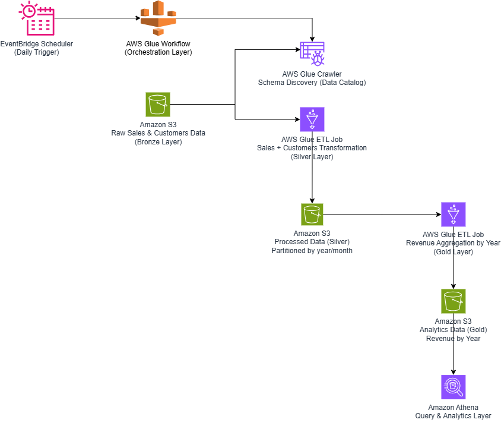

# AWS Glue Lakehouse ETL Pipeline

Pipeline ETL end-to-end construído na AWS utilizando Glue (PySpark) e arquitetura em camadas Bronze, Silver e Gold no padrão Lakehouse.

---

## Diagrama de Arquitetura

---

## Visão Geral do Projeto

Este projeto demonstra a implementação de um pipeline completo de engenharia de dados utilizando serviços gerenciados da AWS:

- AWS Glue ETL Jobs (PySpark) para processamento e transformação dos dados

- Amazon S3 como camada de armazenamento do data lake

- AWS Glue Crawler e Data Catalog para catalogação e gerenciamento de metadados

- Amazon Athena para consultas analíticas sobre as camadas de dados

- AWS Glue Workflow para orquestração dos jobs e controle de dependências

- Amazon EventBridge Scheduler para agendamento automatizado das execuções

- Formato Parquet para otimização de armazenamento e performance nas consultas
  
O pipeline foi estruturado para representar um cenário real de engenharia de dados, com execução automatizada, catalogação de metadados, controle de dependências e organização em camadas.

---

## Fluxo do Pipeline

EventBridge Scheduler (opcional)  
↓  
Glue Workflow  
↓  
Crawler Bronze  
↓  
Job Silver (transformações)  
↓  
Job Gold (agregações de negócio)  

---

## Descrição das Camadas

### Camada Bronze
- Ingestão de dados brutos no Amazon S3  
- Descoberta automática de esquema via Glue Crawler  
- Nenhuma transformação aplicada  
- Camada imutável que representa a fonte original dos dados  

### Camada Silver
- Limpeza e transformação dos dados com PySpark  
- Junção entre datasets de vendas (sales) e clientes (customers)  
- Engenharia de atributos (conversão de timestamp e extração de year/month)  
- Particionamento por `year` e `month`  
- Armazenamento em formato Parquet  

### Camada Gold
- Agregações de nível de negócio  
- Cálculo de receita por ano  
- Dados prontos para consumo analítico no Athena  

---

## Orquestração

- Glue Workflow coordena a execução das etapas  
- Triggers condicionais garantem a ordem correta de execução  
- EventBridge Scheduler permite execução automática programada  

---

## Decisões de Arquitetura

- A arquitetura Bronze/Silver/Gold foi adotada para separar ingestão, transformação e agregação de negócio.
- O particionamento por `year` e `month` melhora a performance das consultas no Athena.
- O Glue Crawler gerencia metadados separadamente da lógica de transformação.
- Os Glue Jobs são parametrizados utilizando `--OUTPUT_PATH`, aumentando portabilidade e reutilização.
- O formato Parquet foi escolhido por sua eficiência de armazenamento e leitura colunar.

---

## Objetivo

Este projeto foi desenvolvido para simular um pipeline de engenharia de dados com padrão próximo a ambientes produtivos, utilizando princípios modernos de Data Lake e Lakehouse.

---

## Autor

Manoel Alexandre Peres
